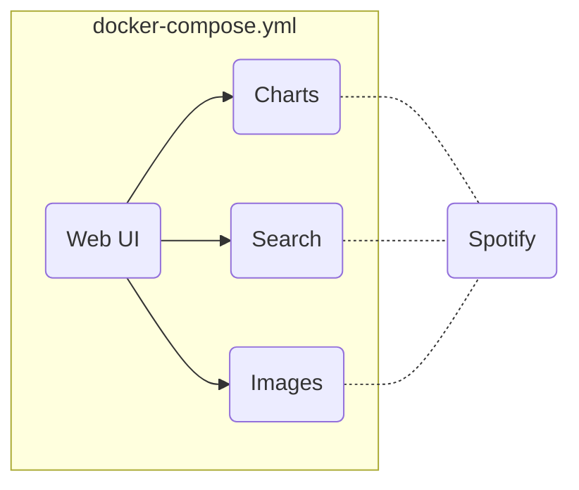

# Docker Microservices Dojo

In this coding dojo, you will implement a mock-up of a web music player. We will leverage
the [Spotify API][1] and a [Java wrapper][2] to get access to music data. We will break down
the necessary functionality into a set of small microservices and orchestrate them to achieve the
desired use case. All services are implemented as RESTful Web Services and should be hosted inside
separate Docker containers. The following figure shows the overall architecture of the service
orchestration.

## Search

The Search service is the main service of the orchestration. It allows to query for artists or
song titles and returns the appropriate Spotify IDs on success. These IDs are the global identifiers
that can be passed to the other services to request an artist's top songs or cover images for a
particular track. The service exposes two different resources: one for tracks and one for
artists. The necessary parameters can be passed via query params. For instance, the search resource
for tracks is available at `{hostaddress}/tracks/search?title={song title}&artist={artist}`. The
track search returns an object that contains the track ID, artist name, and song title.
The artist object solely returns the artist ID and the artist name.

## Charts

The Charts service returns the current top songs for a particular artist.
To get a list of tracks (ID, title, artist) the endpoint needs a valid artist ID. The
resource is exposed at `{hostaddress}/charts/{artistID}`.

## Images

This service provides the cover art for a particular track ID. The endpoint is available at `{hostaddress}/covers/{trackID}`.

## Web

The web project (written in Node.js) mimics a mock-up of a web music player and integrates all of the previously
mentioned services. It will display the currently played song title and artist name together with
the cover art. Moreover, it will also show the current top songs of the artist.
Replace the URLs with your service endpoints inside `routes/index.js` of the web project if necessary.
The user interface is available at `http://{docker-machine-ip}:3000`.
To alter the currently played song, change the URL query params inside the browser
window, e.g., `http://{docker-machine-ip}/?title={songtitle}&artist={artist name}`.

## Task 1: Dockerize Services

Your first task is to dockerize the services described above.

Therefore, create a `Dockerfile` in the root folder of each of the services.
Fill the Dockerfile with the necessary steps to be able to create a Docker image and run a Docker container.
Verify if the service is running correctly by calling an exposed endpoint with `curl` or your Browser.
For testing purposes, you can use artist ID `3XHO7cRUPCLOr6jwp8vsx5` and title ID `57tzAvfPHXHzCHUNp9AUBm`.

### Web

The web project is based on Node.js. You might want to use a small Node.js base image like `node:13-alpine` for your Docker image.
As a first step, copy the artifacts of the web project into an appropriate folder of the image.
Afterwards, you need to run `npm install` to pull the necessary dependencies of the app.
Finally, the Node.js server can be started via `npm start`. Make sure you expose the appropriate server port from the container.

### Search, Charts, Images

The charts, search, and images projects are all based on a Java Gradle build.

As Java code needs to be compiled, we need to use `gradle:6.0.1-jdk8` as base image.
As first step, copy the app artifacts into a folder inside the image.
Run `gradle installDist` to create a runnable distribution at `build/install/{project_name}` including all dependencies of the Java application. You can get each of the project names from `settings.gradle`.

To run the application, you can execute the prepared shell startup scripts inside `build/install/{project_name}/bin/{project_name}`

Slightly adapt the Dockerfiles for each of the remaining service projects.
To run and test the resulting services you need to call `docker run` with the `microservices.env` environment file.

*Optionally*, we want to apply a [multi-stage build][3] here to avoid cluttering the final Docker image with the build artifacts (and keep the image size down) and only create a Docker image with the runnable artifacts. This is a great way to apply the builder pattern and avoid maintaining two separate Dockerfiles.

Therefore, the application container can be based on `alpine`, where we simply install Java via `apk add -U openjdk8-jre`.
Now, copy the compiled application artifacts `build/install/{project_name}` from the build stage inside the application container.

## Task 2: Service Orchestration

All of the described services should be packaged inside their own Docker
container and orchestrated via Docker Compose.
Therefore, adapt the existing `docker-compose.yml` in the root project folder.
Make sure to set appropriate dependencies to allow an automatic bootstrapping of the service composition via `docker-compose up`.
The services images, search, and charts need the `microservices.env` mounted as environment file that provides the credentials for the Spotify API.

Remember, the user interface is available at `http://{docker-machine-ip}:80`. To alter the currently played song, change the URL query params inside the browser window, e.g., `http://{docker-machine-ip}/?title={songtitle}&artist={artist name}`.

As an *optional* improvement, define separate named networks inside the Compose file that isolate at least the frontend from the backend services or even all of the services from each other.

[1]: https://developer.spotify.com/web-api/
[2]: https://github.com/thelinmichael/spotify-web-api-java
[3]: https://docs.docker.com/develop/develop-images/multistage-build/
